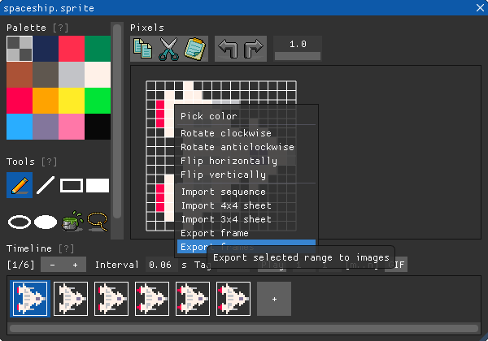
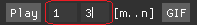

## Plugins for [BASIC8](https://paladin-t.github.io/b8/)

I've made many generic functionalities as native editors in BASIC8, and I've also been getting questions like, "hey, can you make an importer, exporter for ??? format?" One of the reasons I created this repository is to answer these questions. I would prefer to make feature being specific to a particular usage as scriptable plugin, instead of solid functionality. Since they are optional, and not always used developing every disk. Moreover, it feels great to have the editors extendable, rather than limited to what I've provided.

This repository contains plugins for paintable assets that I consider as something between "generic to all" and "specific to one", thus useful but not must have; and necessary information for developing your own plugins. Any pull requests are welcome!

## Contents

You can pick whatever you need, and ignore what you are not interested. But some of the plugin items requires modules in `common` as dependency, so it's recommended to keep that directory, it's also recommended to put reusable modules in it for your own plugins.

* [`common`](common): common modules, imported by code in other directories
	* [`utils.bas`](common/utils.bas)
	* [`frame.bas`](common/frame.bas)
	* [`sheet.bas`](common/sheet.bas)
* [`utilities`](utilities): just as its name implies
	* [`pick color.bas`](utilities/pick%20color.bas)
* [`working area`](working%20area): manipulates pixels for sprite, map, tiles, quantized, etc.
	* [`rotate clockwise.bas`](working%20area/rotate%20clockwise.bas)
	* [`rotate anticlockwise.bas`](working%20area/rotate%20anticlockwise.bas)
	* [`flip horizontally.bas`](working%20area/flip%20horizontally.bas)
	* [`flip vertically.bas`](working%20area/flip%20vertically.bas)
* [`external formats`](external%20formats): importers and exporters
	* [`import sequence.bas`](external%20formats/import%20sequence.bas)
	* [`import 4x4 sheet.bas`](external%20formats/import%204x4%20sheet.bas)
	* [`import 3x4 sheet.bas`](external%20formats/import%203x4%20sheet.bas)
	* [`import tilesheet.bas`](external%20formats/import%20tilesheet.bas)
	* [`export frame.bas`](external%20formats/export%20frame.bas)
	* [`export frames.bas`](external%20formats/export%20frames.bas)

## Using

### Installing

It's not recommended to manipulate regular disks under the library directory manually, but don't be afraid of screwing off to plug these expansions, following these steps:

1. Clone or [download](https://github.com/paladin-t/b8.plugins/archive/master.zip) then extract the latest content to your local storage
2. Create a `plugins` directory under the root directory of your disk library if it's not yet there, BASIC8 looks for plugins exactly under that directory
3. Put extracted plugins under the `plugins` directory, do not include the `.git` stuff if you were cloning from here
4. You need to reopen BASIC8 to use any new plugged expansions

Some plugins requires common modules by the `IMPORT` statement, BASIC8 uses the following directory, for example, as lookup root to import another source file:

* "C:/Users/YourName/Documents/BASIC8/plugins/" on Windows
* "/Users/YourName/Documents/BASIC8/plugins/" on MacOS
* "/home/YourName/Documents/BASIC8/plugins/" on Linux

Keep the directory structure of this repository under your local `plugins` directory, files should be put at, for example:

* "C:/Users/YourName/Documents/BASIC8/plugins/[`common`](common)/[`frame.bas`](common/frame.bas)"
* "C:/Users/YourName/Documents/BASIC8/plugins/[`working area`](working%20area)/[`rotate clockwise.bas`](working%20area/rotate%20clockwise.bas)"
* Etc.

### Running

Right click on the editing area of any paintable asset to show all plugged items that usable for current context. Left click on an item to trigger it.

### Interrupting

Unlike regular disks, plugins run in the same thread with the graphics shell. So you were in charge of guaranteeing a plugin runs and terminates normally, as a plugin developer. Besides, press the Pause/Break key to interrupt the execution whenever developing or using a plugin; click the close button on the BASIC8 window or Alt+F4 for the same affect, even from an unexpected infinite loop.

## Development

Only a subset of the full BASIC8 libraries is exposed to plugin, including `Bytes`, `File`, `Image`, `IO`, `JSON`, `Math`, `System`, `Text` and `Utils`; besides, there are also some dedicated functions exposed for plugin only.

BASIC8 scans and plugs all plugins on startup by running it top down, reopen it for any new created plugin; it also executes top down when triggering a plugin, but you don't need to reopen BASIC8 when developing a plugin's logic iteratively, because each triggering is a new read-evaluate-process loop; for this reason, the plugin interpreter doesn't reserve values with variables for future triggering. These two phases are respectively called "plug" and "run".

### Meta

* `GET_PHASE()`: gets current execution phase
	* returns either "plug" or "run"
* `REGISTER_PLUGIN(target, name, tips = NIL, sel = FALSE, squ = FALSE, cat = 100, pri = 10)`: registers a plugin
	* `target`: asset types to operate on, can be one or more in "sprite", "map", "tiles", "quantized", separated by comma
	* `name`: plugin name
	* `tips`: tooltips
	* `sel`: whether plugin is strictly suitable for selection only
	* `squ`: whether plugin is strictly suitable for square area only
	* `cat`: category
	* `pri`: priority

One plugin file should contains zero (for common module) or one (for functional plugin) entry calling the `REGISTER_PLUGIN` function, generally you only need to call it during "plug" phase. The `sel`, `squ` parameters are orthogonal in the `REGISTER_PLUGIN` function; final items will be sorted by `cat` primarily, then falls to `pri` with same priority.

### Disk and assets

* `GET_DISK_CONTAINER_DIRECTORY()`: gets the path of container directory of the current disk
	* returns directory path
* `GET_DISK_CONTENT_DIRECTORY()`: gets the path of content directory of the current disk
	* returns directory path

* `GET_ASSET_FILE()`: gets the file path of the current asset
	* returns file path
* `SET_ASSET_UNSAVED()`: sets the current asset to unsaved

### Working area

Sprite frame, map layer and quantized image are all conceptualized as "frame" with working area functions. Index of sprite starts from 1.

* `GET_FRAME_COUNT()`: gets the count of frames in the current asset
	* returns integer
* `GET_FRAME_RANGE()`: gets the active range in the current asset, only works with sprite by following indicator
	* returns vec2 for begin, end frame indices

* `GET_FRAME_SIZE()`: gets the size in pixels a frame or tile count of a map
	* returns vec2 for width, height
* `GET_FRAME_INDEX()`: gets the selected frame index of the current asset
	* returns integer
* `SET_FRAME_INDEX(i)`: sets the selected frame index of the current asset
	* `i`: target index

* `HAS_SELECTION()`: checks whether any area is selected by the lasso tool
	* returns true if any area selected
* `GET_SELECTION_RANGE()`: gets the selected area
	* returns vec4 for left, top, right, bottom, or nil for none selection

* `GET_CURSOR_POSITION()`: gets the position of the cursor
	* returns vec2 for x, y, or nil for not available

* `GET_PIXEL(x, y)`: gets the data at a specific position
	* `x`: x position
	* `y`: y position
	* returns palette index, or tile index for map
* `SET_PIXEL(x, y, p)`: sets the data at a specific position with given data
	* `x`: x position
	* `y`: y position
	* `p`: index as integer

### Operation

* `PUSH_OPERATION(op [, i])`: pushes an operation, as if operated manually by a user on editors
	* `op`: operation type, only "add" available until now, for adding frame or layer to sprite, map assets
	* `i`: where to add before, or append to tail if this parameter is ignored
* `BEGIN_OPERATION([msg])`: begins a plugin operation
	* `msg`: text message to be displayed on the undo/redo tooltip
* `END_OPERATION()`: ends a plugin operation

All pixel modifications by the `SET_PIXEL` function are encapsulated between a pair of `BEGIN_OPERATION` and `END_OPERATION`, for undo/redo together.

### Source

* `GET_SOURCE_INDEX()`: gets the selected palette color, tile index, etc.
	* returns integer
* `SET_SOURCE_INDEX(src)`: sets the selected palette color, tile index, etc.
	* `src`: integer

* `GET_PALETTE_FROM_COLOR(c)`: gets the palette index represents for the nearest color with specific color
	* `c`: color to match
	* returns palette index
* `GET_COLOR_FROM_PALETTE(p)`: gets the RGBA value from specific palette index
	* returns RGBA value

### File dialog

* `OPEN_FILE_DIALOG([y, m = FALSE])`: shows a dialog box for opening file
	* `y`: file type extensions, separated by comma
	* `m`: true for multiple selection
	* returns file path for single selection, list of file paths for multiple selection, or nil for canceled
* `SAVE_FILE_DIALOG([y])`: shows a dialog box for saving file
	* `y`: file type extensions, separated by comma
	* returns file path, or nil for canceled
